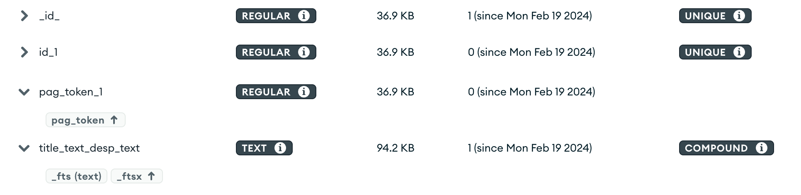

## Youtube Video Fetcher
This service continuously fetches videos from Youtube and makes it available from its own search interface

### Services
  - DB
  - Poller
  - API

### TechStack
  - FastAPI
  - MongoDB
  - Pydantic 
  - Docker, Docker Compose
  - Youtube Data V3 API

### Sample Request

#### Request
http://127.0.0.1:8000/videos?query=surfing&page_size=3&page_no=1&ascending=false

#### Response:
```json

  {
    "max_page": 61,
    "curr_page": 1,
    "page_size": 2,
    "videos": [
      {
        "id": "SkPcQrHodMk",
        "title": "Surfing small river lump",
        "desp": "",
        "publishing_datetime": 1708285082,
        "thumbnail": "https://i.ytimg.com/vi/SkPcQrHodMk/default.jpg"
      },
      {
        "id": "Rkcq-53Nehk",
        "title": "Surf practice",
        "desp": "Everything begins and ends #bondibeach #bondibeachsydney #visitbondibeach #bondibeachgraffitiwall #northbondibeach ...",
        "publishing_datetime": 1708285013,
        "thumbnail": "https://i.ytimg.com/vi/Rkcq-53Nehk/default.jpg"
      }
    ]
  }

```

### DB Schema
#### Video Document

```json
  {
    "_id": {
      "$oid": "65d1e37d0bb7ab2fe37b13da"
    },
    "id": "bkoxweDWzvY",
    "title": "Today Was CROWDED!!! (DAY 14) #surfing #surf #surftok",
    "desp": "",
    "publishing_datetime": 1708241317,
    "thumbnail": "https://i.ytimg.com/vi/bkoxweDWzvY/default.jpg",
    "pag_token": "1708241317.0bkoxweDWzvY"
  }
```
#### Indexes
  


### Steps To Run
  1.  Use the docker compose file, db_dump and provide the YT_API_KEYS env variable
      ```cmd
        export YT_API_KEYS='["<API_KEY_1>", "<API_KEY_2>"]'
      ```
  2. Start the services
      ```cmd
        docker compose up
      ```
  3. Import database index settings:
      ```cmd
        mongorestore db_dump
      ```
  4. Go to http://localhost:8000/docs to view the FastAPI Interactive docs   

### Tasks
  - [x] Poller to poll the Youtube API and store videos in the Database
  - [x] GET API which returns the stored video data in a paginated response sorted in descending order of published datetime.
  - [x] Dockerized the Project
  - [x] Support for supplying multiple API keys so that if quota is exhausted on one, it automatically uses the next available key
  - [x] Advanced Search API (Powered by [MongoDB Text Searching](https://www.mongodb.com/docs/manual/core/link-text-indexes/#std-label-text-search-on-premises))
  - [x] Ability to choose between ascending and descending order in API
  - [ ] Make a dashboard to view the stored videos with filters and sorting options (optional)